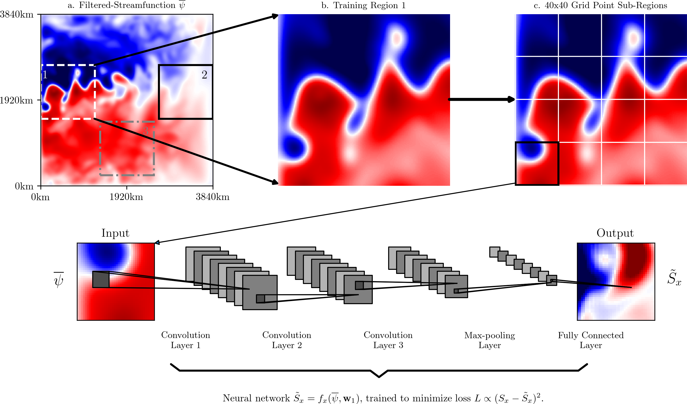

# DeepEddy

***



***

This repository contains the python code used for the paper titled: 

**"Applications of Deep Learning to Ocean Data Inference and Sub-Grid 
Parameterisation".** 

Thomas Bolton, Laure Zanna

Atmospheric, Oceanic, and Planetary Physics, University of Oxford 

tom.bolton@physics.ox.ac.uk

This repository contains the python code, the saved trained neural networks from Keras, and their validation losses during training. The primary file is DeepEddy.py, which contains functions to calculate the eddy momentum forcing, training individual neural networks, and form predictions using the validation data.

## Activation Maps

Included in DeepEddy.py is a function which extracts the activation maps of each convolution layer and plots them for a particular input sample. The activation map is the result of the convolution acting on the previous layers output, and then passing it through the activation function.

In order to examine more clearly what each convolution layer is doing, we construct a "clean" input streamfunction to feed into one of the already-trained neural networks. We use a radially-symmetric Gaussian function to generate a "fake" eddy streamfunction to use as an input. We then give this input to the neural network, and examine the activation maps at each stage. The results are shown in the image below.

The interesting part are the activation maps of the first convolution layer. These activation maps resemble a collection of 1st and 2nd order derivatives. Therefore, without a priori knowledge, the neural network learns to take derivates of the input streamfunction, which physically corresponds to velocities and velocity shears. This is a robust feature across all of the neural networks trained to predict the eddy momentum forcing.


Most of the functions in DeepEddy.py cannot be run solely using the contents of this repository, as the data files (for training and predicting) are too large (~2 GB per file) to upload to GitHub. However, the function to plot the activation maps can be run from the contents of this repository, as it only needs the file for a trained neural network. Any of the neural networks saved in the 'models/' directory will do. To create the above image of the activation maps, simply run the following code.

```python

from DeepEddy import *

# the function below will use the saved
# neural network 'cnn30km_1_Sx_200e.h5'
 
plotSyntheticActivationMaps()

```
